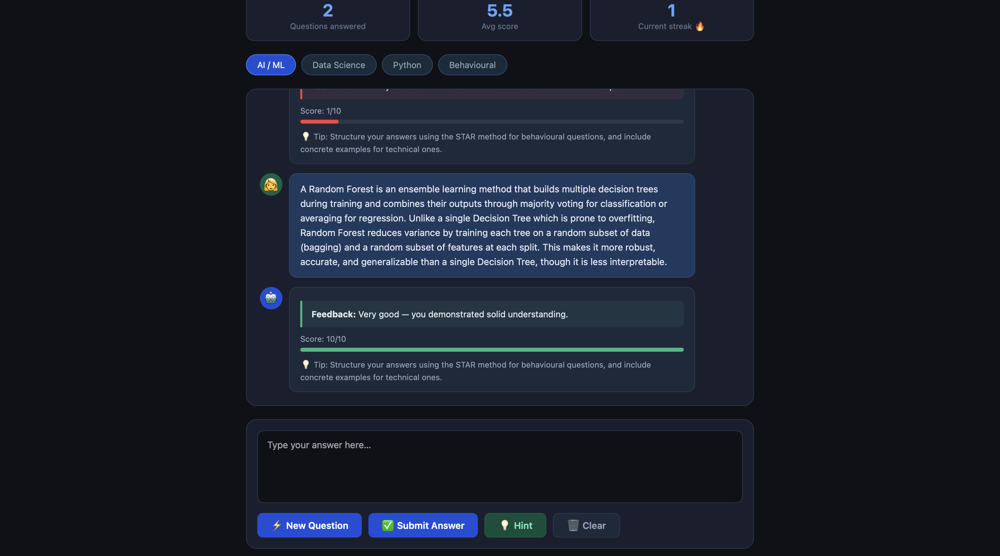
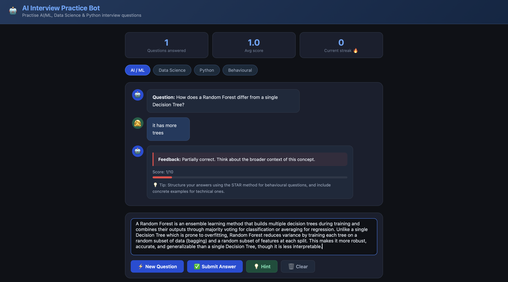

# 🤖 AI Interview Practice Bot — Django Web App

A Django-based web chatbot that helps job seekers practise AI/ML, Data Science, Python, and Behavioural interview questions with instant feedback and scoring.

## Author
Yasmeen Azmat Ali
MSc Artificial Intelligence
University of West London

## Project Overview
This project implements an interactive interview practice chatbot built with Django. Users can select a question category, type their answer, and receive instant AI-generated feedback with a score out of 10.

## Project Features
- 4 question categories: AI/ML, Data Science, Python, Behavioural
- Real-time scoring and feedback after each answer
- Hint system to help when stuck
- Streak tracker for motivation
- Dark-mode responsive UI

## System Architecture
The application consists of the following components:
- Django backend with REST API endpoints
- Question bank with 24+ curated interview questions
- Feedback engine with scoring logic
- Django template frontend with vanilla JavaScript

## Screenshots

### Main Interface


### Question and Answer


### Feedback and Score


## Technologies Used
- Python 3.13
- Django 6.0
- JavaScript (Vanilla)
- HTML5 / CSS3
- REST APIs (Django JSON views)

## Features
- Random question selection per category
- Answer evaluation with 1–10 scoring
- Color-coded feedback (red/yellow/green)
- Hint reveal system
- Questions answered counter and average score tracker
- Streak tracking for consecutive good answers

## Getting Started

### 1. Clone the repository
```
git clone https://github.com/yasmeenmh90-beep/ai-interview-practice-bot.git
cd ai-interview-practice-bot
```

### 2. Create virtual environment
```
python3 -m venv venv
source venv/bin/activate
```

### 3. Install dependencies
```
pip install django
```

### 4. Run the server
```
python manage.py runserver
```

### 5. Open in browser
```
http://127.0.0.1:8000
```

## Question Categories
- **AI / ML** — Supervised learning, transformers, gradient descent, overfitting, BERT
- **Data Science** — Feature engineering, PCA, outliers, correlation vs causation
- **Python** — Decorators, generators, GIL, pandas
- **Behavioural** — STAR method, career goals, remote work

## Future Work
- Integrate Claude/OpenAI API for intelligent answer evaluation
- User authentication and session history
- Spaced repetition for weak questions
- Voice input support
- PDF report export

## License
This project is for academic and portfolio purposes.
